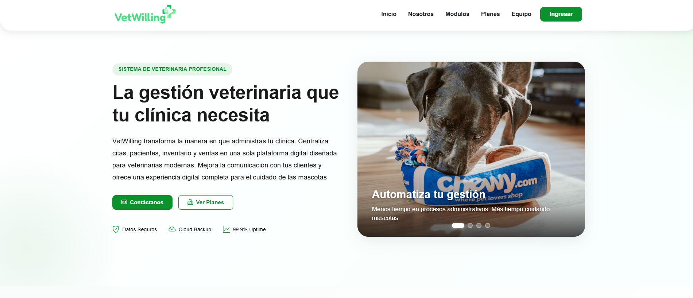

<!--
Personalized version — built from your real GitHub profile (24 repos, VetWilling
collaboration) and portfolio site. Paste into the README.md of the special
brayandrad3/brayandrad3 repository.
-->

  

 

## Two crafts, one developer

I started in **audiovisual production**, trained at Escuela Nacional de Cine, working with storytelling, composition, and visual communication. Today I'm finishing the **Software Analysis and Development** program (ADSO) at SENA in Colombia — and I build software the way I used to build a shot: think about the audience first, then execute with precision.

That background is why I don't just write code that runs — I care whether the interface makes sense to the person using it. Full stack development gives me both halves: backend logic and data, front-end experience and design.

 

## How I work

I like owning the full lifecycle of a feature, not just the ticket:

`Research` → `Requirements` → `UX/UI & Wireframes` → `DB modeling & UML` → `Backend` → `Frontend` → `Testing` → `Deployment` → `Docs`

Understanding the business problem comes before writing the solution.

 

## 🎯 Open to Work

> Looking for a role as **Junior Full Stack Developer / Backend Developer / PHP–Laravel Developer**.
> Open to remote, hybrid, or on-site — Colombia or international. Let's talk: [LinkedIn](https://www.linkedin.com/in/brayan-andrad3) · [email](mailto:brayanestivenandradecarrillo@gmail.com)

 

## 🩺 Flagship project — VetWilling

My biggest collaborative build: a **veterinary clinic management platform**, developed as the final graduation project for ADSO at SENA.

**[Repository](https://github.com/WilliamSanchezR/VETWILLING) · [Live site](https://vetwilling.com/)**

It manages medical records, pet registration, appointment scheduling, inventory, sales, services, staff, roles/permissions, and reporting — a real multi-module system, not a CRUD demo. **1,000+ commits**, built with Laravel, PHP, MySQL, Bootstrap and JavaScript.

My contributions went beyond code: requirements engineering, user research and surveys, the software requirements spec (SRS/ERS), UML and sequence diagrams, wireframes, UI design, the brand identity manual, and both frontend/backend implementation plus deployment.

 

## 🛠️ Tech Stack

**Frontend**

**Backend**

**Database**

**Design**

**Tooling**

**Currently learning**

Advanced Laravel · Clean Architecture · REST API Design · Software Design Patterns

 

## 💻 Other Projects

Practice builds from the ADSO program — each one sharpened a specific skill on the way to VetWilling:

More on my [portfolio](https://brayandrad3.github.io/Portafolio-web-personal/).

 

## 📊 GitHub Stats

 

## 🏆 Certifications

- [ ] Certification name — Issuer, Year
- [ ] Certification name — Issuer, Year

 

## 📫 Let's talk

